# HTML5 and CSS3: The Essential Guide <!-- omit in toc -->


---

## Contents <!-- omit in toc -->

- [1. Introduction](#1-introduction)
  - [1.1. An Intro](#11-an-intro)
  - [1.2. How web works?](#12-how-web-works)
  - [1.3. Chrome DevTools](#13-chrome-devtools)
  - [1.4. The Big Picture](#14-the-big-picture)
- [2. Basic Web Pages](#2-basic-web-pages)
  - [2.1. Structure of a web page](#21-structure-of-a-web-page)
  - [2.2. A Few HTML Elements or Tags](#22-a-few-html-elements-or-tags)
    - [2.2.1. Page Title `<title>`](#221-page-title-title)
    - [2.2.2. Paragraphs `<p>`](#222-paragraphs-p)
    - [2.2.3. headings `<h>`](#223-headings-h)
    - [2.2.4. Unordered Lists `<ul>`](#224-unordered-lists-ul)
    - [2.2.5. Ordered Lists `<ol>`](#225-ordered-lists-ol)
    - [2.2.6. Block and Inline Level](#226-block-and-inline-level)
    - [2.2.7. Emphasis (Italic) Elements `<em>`](#227-emphasis-italic-elements-em)
    - [2.2.8. Strong (Bold) Elements `<strong>`](#228-strong-bold-elements-strong)
  - [2.3. Empty HTML Elements](#23-empty-html-elements)
    - [2.3.1. Line Breaks `<br />`](#231-line-breaks-br-)
    - [2.3.2. Horizontal Rules `<hr />`](#232-horizontal-rules-hr-)
    - [2.3.3. Optional Trailing Slash in an Empty Elements](#233-optional-trailing-slash-in-an-empty-elements)
  - [2.4. Summary](#24-summary)
- [3. Links and Images](#3-links-and-images)
- [4. Hello, CSS](#4-hello-css)
- [5. The Box Model](#5-the-box-model)
- [6. CSS Selectors](#6-css-selectors)
- [7. Floats](#7-floats)
- [8. Flexbox](#8-flexbox)
- [9. Grid](#9-grid)
- [10. Advanced Positioning](#10-advanced-positioning)
- [11. Responsive Design](#11-responsive-design)
- [12. Responsive Images](#12-responsive-images)
- [13. Semantic HTML](#13-semantic-html)
- [14. Forms](#14-forms)
- [15. Web Typography --\>](#15-web-typography---)

## 1. Introduction

### 1.1. An Intro

- HyperText Markup Language (HTML)
- Cascading Style Sheets (CSS), and
- JavaScript
  
are the languages that run the web.

- **HTML** is for adding meaning to raw content by **marking** it up.
- **CSS** is for formatting that marked up content.
- **JavaScript** is for making that content and formatting interactive.

> Note: JavaScript can be used outside the browser/HTML environment like in Node.js.

### 1.2. How web works?

For example, the URL,  <http://google.com>, how it goes from client/browser to server and back to client.

1. Browser send http request to server
2. Server returns http response to browser
3. The http response contains HTML
4. Browser reads HTML to construct the DOM (Document Object Model).
5. Finally, browser, renders (displays) DOM in the browser.

- **URL** (Uniform Resource Locator)
- **DOM** - an in-memory representation of the elements on the HTML web page. This is what JavaScript interact with.

### 1.3. Chrome DevTools

- F12,
- Network tab,
- HTTP request
- HTTP response
- Preview
- status code
- content type
- Filter network requests

### 1.4. The Big Picture

Think of HTML as the abstract text and images behind a web page, CSS as the page that actually gets displayed, and JavaScript as the behaviors that can manipulate both HTML and CSS.

Ex,

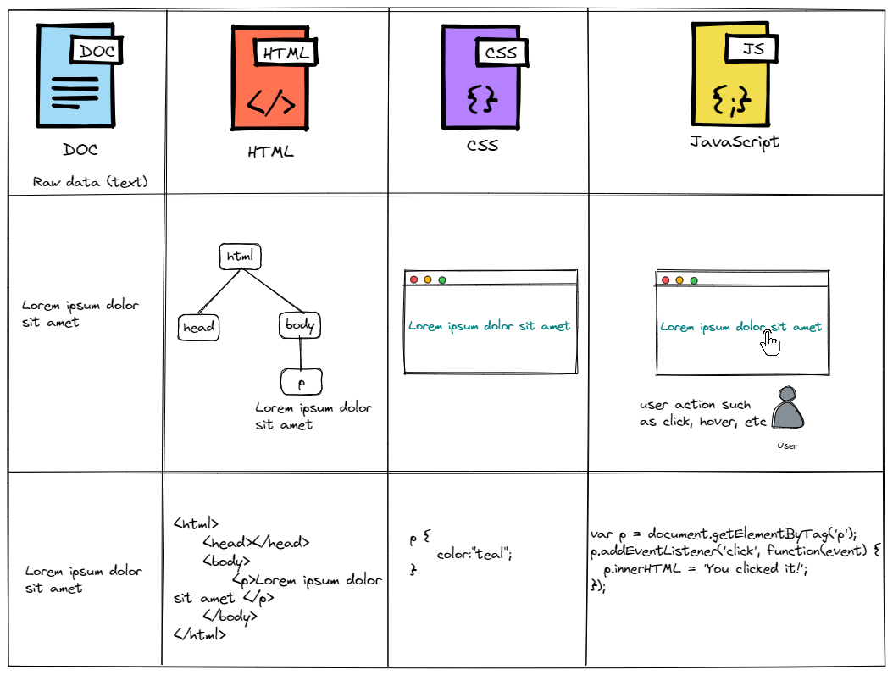

- In above example, we mark some particular text as a `paragraph` with this `<p></p>` HTML.
- Then, we set the color of that paragraph with some CSS.
- When the user clicks it on it, we run some JavaScript.

## 2. Basic Web Pages

HTML defines the content of every web page on the Internet. By “marking up” your raw content with HTML tags, you’re able to tell web browsers how you want different parts of your content to be displayed.

### 2.1. Structure of a web page

```html
<!DOCTYPE html>
<html>
  <head>
    <!-- Metadata goes here -->
  </head>
  <body>
    <!-- Content goes here -->
  </body>
</html>
```

- The line `<!DOCTYPE html>` tells browsers that this is an HTML5 web page.
- The entire web page needs to be wrapped in `<html>` tags.
- `<html>` text is called an **opening tag** and `</html>` is called a **closing tag**.
- Everything inside of these tags are considered part of the `<html>` **element**, which is what gets created when a web browser parses the HTML tags.

   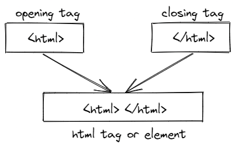

- Inside of the `<html>` element, we have two more elements called `<head`> and `<body>`.
- A web page’s `head` contains all of its metadata such as page title, CSS, JavaScript, fonts etc which are required to render the page but we don’t necessarily want the user to see them.
- The `<body>` element, which represents the visible content of the page. In our case, its empty since it has an empty `<body>`.

  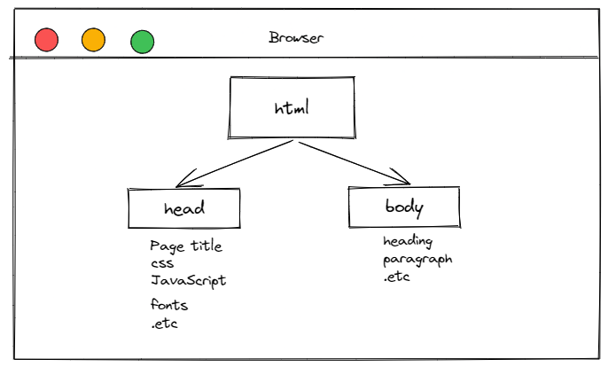

- Anything that starts with `<!--` and ends with `-->` will be completely ignored by the browser and these are called comments.

### 2.2. A Few HTML Elements or Tags

Create a page, `index.html` and lets putting the html elements into it.

#### 2.2.1. Page Title `<title>`

This is the title of webpage denoted ny `<title>` element. The browser displays this in the tab for our page, and search engines such as google, duckduckgo displays it in search results.

Result in the browser,

 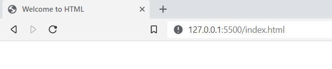

#### 2.2.2. Paragraphs `<p>`

 The `<p>` element marks all the text inside it as a distinct paragraph.

 ```html
<!DOCTYPE html>
<html>
  <head>
    <title>Welcome to HTML</title>
  </head>
  <body>
    <p>Hello HTML, you are awesome.</p>
  </body>
</html>
 ```

 Result,

 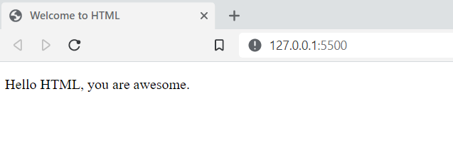

#### 2.2.3. headings `<h>`

- Headings are like titles, but they’re actually displayed on the page.
- HTML provides six levels of headings, `<h1>` `<h2>` `<h3>` `<h4>` `<h5>` and `<h6>`
- Higher the number, lesser the prominence heading.

```html
<body>
  <h1>Welcome homie</h1>
  <p>Hello HTML, you are awesome.</p>
</body>
```

 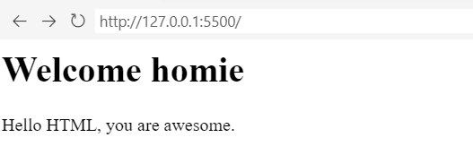

What of second and other level of headings?
Lets see them,

 ```html
 <body>
  <h1>Welcome homie</h1>
  <h2>Welcome homie</h2>
  <h3>Welcome homie</h3>
  <h4>Welcome homie</h4>
  <h5>Welcome homie</h5>
  <h6>Welcome homie</h6>
  <p>Hello HTML, you are awesome.</p>
</body>
 ```

This should result in a web page that looks something like this:

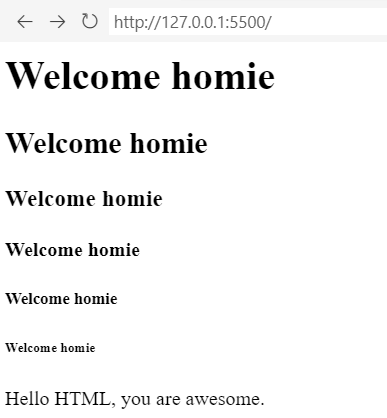

#### 2.2.4. Unordered Lists `<ul>`

Wrapping content in `<ul>` tags tells a browser that whatever is inside should be rendered as an **unordered list**. To denote individual items in that list, we wrap them in `<li>` tags, such as,

```html
<ul>
  <li>Facebook</li>
  <li>Instagram</li>
  <li>WhatsApp</li>
</ul>
```

In browser,

 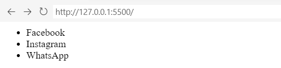

Note: `<ul>` element should only be containing `<li>` as a direct child.

❌ BAD

```html
<ul>
  <p>hello</p>
</ul>
```

✅ GOOD

```html
<ul>
  <li><p>hello</p></li>
</ul>
```

#### 2.2.5. Ordered Lists `<ol>`

With an unordered list, sequence of list items does matter, but when we need the sequence to our list item, thats when reach out to ordered list `<ol>`

To create an ordered list, simply change the parent `<ul>` element to `<ol>`.

```html
<ol>
  <li>Facebook</li>
  <li>Instagram</li>
  <li>WhatsApp</li>
</ol>
```

Would result in,

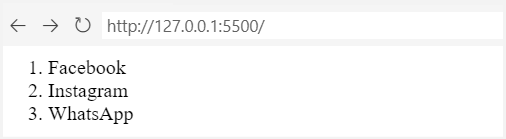

Notice that the browser automatically incremented the count for each `<li>` element.

#### 2.2.6. Block and Inline Level

> **Block-level Elements or flow Content:** are HTML elements which are always drawn on a new line. for an instance, `<p>` is a block-level element.
>
>
> **Inline elements or Phrasing Content:** are HTML elements which can affect sections of text anywhere within a line. For example, `<em>` is an inline element that affects a span of text inside of a `paragraph`. It stands for `emphasis`, and it’s typically displayed as italicized text.

Ex,

```html
<p>Block Level Elements</p>

<p>
  <em>Sometimes</em>, you need to draw attention to a particular word or phrase.
</p>
```

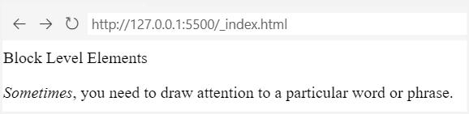

- Look at how `<p>` is rendered in a new line.
- See how `<em>` only part of a line has been affected, which is characteristic of inline elements.

#### 2.2.7. Emphasis (Italic) Elements `<em>`

It stands for `emphasis`, and it’s typically displayed as italicized text.

```html
<p>The past can't hurt you anymore, not unless <em>you let it</em>.</p>
```

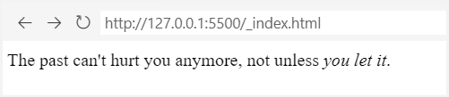

The part wrapped in `<em>` tags should render as *italics*, as shown above.

#### 2.2.8. Strong (Bold) Elements `<strong>`

If we want to be more emphatic than an `<em>` tag, we can use `<strong>`. It’s an inline element just like `<em>`, and looks like this:

```html
<p>The past can't hurt you anymore, not unless <strong>you let it</strong>.</p>
```

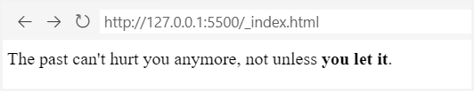

It should be rendered in **bold text**.

Let's combine `<em>` and `<strong>` and see what happens,i.e. nest an `<em>` element in a `<strong>` or vice versa.

```html
<p>
  The past can't hurt you anymore, not unless
  <strong><em>you let it.</em></strong>
</p>
```

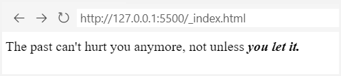

So, we get a **bold** text in **italics**.

### 2.3. Empty HTML Elements

The HTML tags we’ve seen so far either wrap text content i.e. `<p>`, `<h1>` or `<em>` or other HTML elements such as `<ol>`.But, some of them can be **empty** or **self-closing**.
  
  1. Line breaks
  2. Horizontal rules

are the most common empty elements.

#### 2.3.1. Line Breaks `<br />`

HTML condenses consecutive spaces, tabs, or newlines (together known as **whitespace**) into a single space.

Ex,

```html
<h2>React</h2>

<p>It's a library to build user interfaces</p>

<p>Post by,
Avinash</p>
```

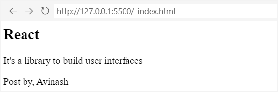

The newline after `Post by,` in the above snippet will be transformed into a space instead of displaying as a line break as shown in above screen.

Then, how do we put a empty line, To tell the browser that we want a hard line break, we need to use an explicit `<br />` element, like this:

Ex,

```html
<h2>React</h2>

<p>It's a library to build user interfaces</p>

<p>Post by,<br />
Avinash</p>
```

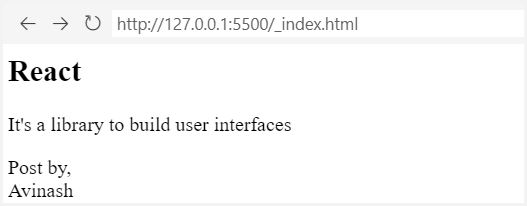

We can use the `<br/>` element in scenarios such as in email, signature, movie or music credits etc

#### 2.3.2. Horizontal Rules `<hr />`

The `<hr />` element is a **horizontal rule**, which represents a **thematic break**.

For instance,

```html
<h2>React</h2>

<p>It's a library to build user interfaces</p>

<p>
  Post by,<br />
  Avinash
</p>
<hr />
<p>
  P.S. This page might look like crap, but we'll fix that with some CSS soon.
</p>
```

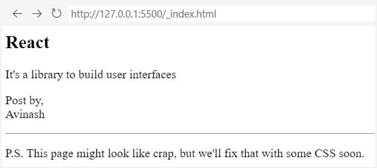

>Note: Don't abuse the `<br />` and `<hr />` to add lots new line spaces or horizontal line respectively. We can use CSS for presentation and leave the HTML for marking up (content).

❌ BAD

```html
<p>a paragraph needs some space below it...</p>
<br /><br /><br /><br /><br /><br /><br /><br />
<hr />
<p>So, I added some hard line breaks.</p>
```

#### 2.3.3. Optional Trailing Slash in an Empty Elements

The trailing slash (/) in all empty HTML elements is entirely optional.

Let us rewrite above example without trailing slash,

```html
<h2>React</h2>

<p>It's a library to build user interfaces</p>

<p>
  Post by,<br>
  Avinash
</p>
<hr>
<p>
  P.S. This page might look like crap, but we'll fix that with some CSS soon.
</p>
```

Notice both `hr` and `br` are not having trailing slash (/) and still the output is same. For sake of consistency and conventions we use the all the tags with closing trailing slash.

### 2.4. Summary

Official HTML elements reference can be found here, <https://developer.mozilla.org/en-US/docs/Web/HTML/Element>

TODO:

List down all the html element at once
<https://developer.mozilla.org/en-US/docs/Learn/HTML/Cheatsheet>

```html
<!DOCTYPE html>
<html>
  <head>
    <title>Document</title>
  </head>
  <body>
    <h1>Welcome homie</h1>
    <h2>Welcome homie</h2>
    <p>Hello HTML, you are awesome.</p>
    <ul>
      <li>Facebook</li>
      <li>Instagram</li>
      <li>WhatsApp</li>
    </ul>

    <ol>
      <li>Facebook</li>
      <li>Instagram</li>
      <li>WhatsApp</li>
    </ol>

    <p>The past can't hurt you anymore, not unless <em>you let it</em>.</p>
    <p>
      The past can't hurt you anymore, not unless <strong>you let it</strong>.
    </p>
    <p>
      The past can't hurt you anymore, not unless
      <strong><em>you let it.</em></strong>
    </p>

    <h2>React</h2>

    <p>It's a library to build user interfaces</p>

    <p>
      Post by,<br />
      Avinash
    </p>
    <hr />
    <p>
      P.S. This page might look like crap, but we'll fix that with some CSS
      soon.
    </p>
  </body>
</html>
```

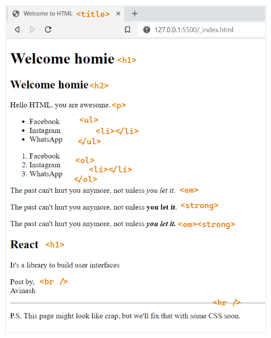

## 3. Links and Images

Till now we have seen few very important HTML elements, but we were only dealing with a single web page. **Links** and **images** are fundamentally different from those elements in that they deal with external resources.

1. Links point the user to a different HTML document
2. Images pull another resource into the page.

## 4. Hello, CSS

## 5. The Box Model

## 6. CSS Selectors

## 7. Floats

## 8. Flexbox

## 9. Grid

## 10. Advanced Positioning

## 11. Responsive Design

## 12. Responsive Images

## 13. Semantic HTML

## 14. Forms

## 15. Web Typography -->