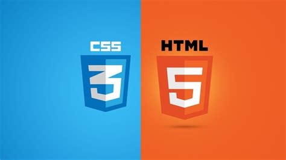

---

## Contents <!-- omit in toc -->
- [1. Introduction](#1-introduction)
  - [1.1. An Intro](#11-an-intro)
  - [1.2. How web works?](#12-how-web-works)
  - [1.3. Chrome DevTools](#13-chrome-devtools)
  - [1.4. The Big Picture](#14-the-big-picture)

## 1. Introduction

### 1.1. An Intro

- HyperText Markup Language (HTML)
- Cascading Style Sheets (CSS), and 
- JavaScript
  
are the languages that run the web.

- **HTML** is for adding meaning to raw content by marking it up.
- **CSS** is for formatting that marked up content.
- **JavaScript** is for making that content and formatting interactive.

> Note: JavaScript can be used outside the browser/HTML environment like in Node.js.

### 1.2. How web works?

For example, the URL,  http://google.com, how it goes from client/browser to server and back to client.
1. Browser send http request to server
2. Server returns http response to browser
3. The http response contains HTML
4. Browser reads HTML to construct the DOM (Document Object Model).
5. Finally, browser, renders (displays) DOM in the browser.

- **URL** (Uniform Resource Locator)
- **DOM** - an in-memory representation of the elements on the HTML web page. This is what JavaScript interact with.

### 1.3. Chrome DevTools

- F12, 
- Network tab, 
- HTTP request
- HTTP response
- Preview 
- status code
- content type
- Filter network requests

### 1.4. The Big Picture

Think of HTML as the abstract text and images behind a web page, CSS as the page that actually gets displayed, and JavaScript as the behaviors that can manipulate both HTML and CSS.

Ex,

- In above example, we mark some particular text as a `paragraph` with this `

` HTML.
- Then, we set the color of that paragraph with some CSS.
- When the user clicks it on it, we run some JavaScript.

Unfortunately, mastering HTML, CSS, and JavaScript is only a prerequisite

<!-- ## 2. Basic Web Pages

## 3. Links and Images

## 4. Hello, CSS

## 5. The Box Model

## 6. CSS Selectors

## 7. Floats

## 8. Flexbox

## 9. Grid

## 10. Advanced Positioning

## 11. Responsive Design

## 12. Responsive Images

## 13. Semantic HTML

## 14. Forms

## 15. Web Typography -->

